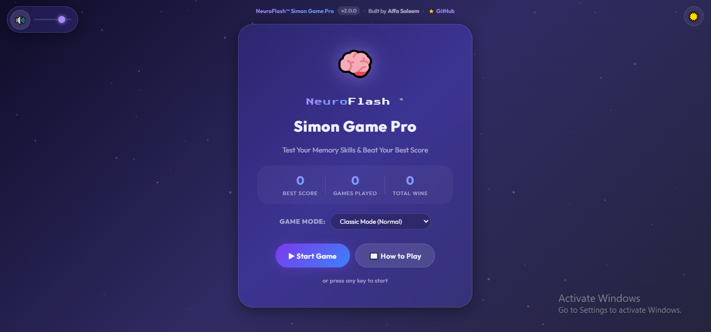

# 🎮 Simon Game Pro – Interactive Memory Challenge

A modern and responsive memory game built using **HTML, CSS, JavaScript, and jQuery**. The game challenges players to memorize and repeat increasingly complex color sequences while improving concentration and memory skills.

## 🚀 Live Demo

🔗 https://affasaleem.github.io/Simon-Game/

---

## 📸 Preview

Add screenshots or GIFs here.

```md

```

---

## ✨ Features

* 🎯 Classic Simon Game Gameplay
* 📱 Fully Responsive Design
* 🎨 Modern Glassmorphism UI
* 🌙 Dark Theme Experience
* 🔊 Interactive Sound Effects
* 🏆 Score Tracking
* 💾 Local Storage Support
* ⚡ Smooth Animations
* 🎮 Keyboard & Mouse Support
* 📊 Level Progression System
* 🔄 Restart Functionality
* 🎯 Memory Training Experience

---

## 🛠️ Built With

* HTML5
* CSS3
* JavaScript (ES6)
* jQuery

---

## 📂 Project Structure

```bash
Simon-Game-Pro/
│
├── index.html
├── styles.css
├── game.js
│
├── sounds/
│   ├── red.mp3
│   ├── blue.mp3
│   ├── green.mp3
│   ├── yellow.mp3
│   └── wrong.mp3
│
└── README.md
```

---

## 🎮 How To Play

1. Press any key or click the Start button.
2. Watch the sequence shown by the game.
3. Repeat the sequence by clicking the colored buttons.
4. Each level adds a new color to the sequence.
5. Continue as long as you can remember the pattern.
6. The game ends when an incorrect color is selected.

---

## 🏆 Scoring System

| Action         | Points      |
| -------------- | ----------- |
| Complete Level | +1 Level    |
| New High Score | Achievement |
| Wrong Move     | Game Over   |

Try to beat your highest score every time!

---

## 📱 Responsive Design

This project is optimized for:

* Desktop
* Laptop
* Tablet
* Mobile Devices

---

## 🎯 Learning Outcomes

Through this project, I practiced:

* DOM Manipulation
* Event Handling
* jQuery Fundamentals
* JavaScript Functions
* Arrays and Loops
* Game Logic Development
* Responsive Web Design
* UI/UX Improvements
* Local Storage Usage

---


## 🔮 Future Improvements

* Achievement System
* Dark/Light Theme Toggle
* Sound Controls
* Multiplayer Mode
* Online Leaderboard
* PWA Support
* Statistics Dashboard
* Confetti Celebrations

---

## 🤝 Contributing

Contributions, suggestions, and improvements are welcome.

Feel free to fork the repository and submit a pull request.

---

## 📬 Connect With Me

GitHub:
[Add your LinkedIn profile link](https://github.com/affasaleem)

LinkedIn:
[Add your LinkedIn profile link](https://lk.linkedin.com/in/affasaleem)

Portfolio:
[Add your portfolio website link](https://affasaleem.github.io/my-portfolio/)

---

## ⭐ Support

If you like this project, consider giving it a ⭐ on GitHub.

---

## 👨‍💻 Author

**Affa Saleem**

Aspiring Frontend Developer passionate about building interactive and user-friendly web applications.

---

### Made with ❤️ using HTML, CSS, JavaScript & jQuery
